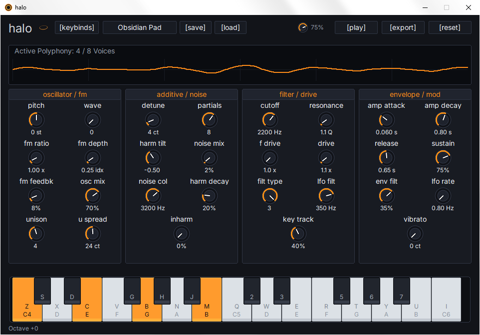

  

<h2 align="center">halo</h2>

  8-voice hybrid additive/subtractive spectral synthesizer (C99/Win32)

---

  

---

### input/output

| Signal | Description |
| :--- | :--- |
| **Key Input** | On-screen piano and `QWERTY` keyboard input |
| **Audio Output** | `44.1 kHz` `Stereo` stream to the default Windows audio device |

---

### shortcuts

| Key / Command | Action |
| :--- | :--- |
| `Z X C V B N M ,` | Lower octave white keys (C4–C5) |
| `S D G H J` | Lower octave black keys (C#4–A#4) |
| `Q W E R T Y U I` | Upper octave white keys (C5–C6) |
| `2 3 5 6 7` | Upper octave black keys (C#5–A#5) |
| `Up / Down Arrow` | Shift musical typing octave |
| `Space / Enter` | Play audition chord (C4–E4–G4) |
| `K` | Open keybinds window |
| `Ctrl + E` | Export current voice to WAV (oneshot-style) |
| `Escape` | Close popup / Exit |

---

### controls

| Control | Description |
| :--- | :--- |
| **On-Screen Piano** | Click or slide to trigger notes; velocity from vertical position |
| **Knobs** | Drag vertically to adjust; hold `Shift` for fine tuning |
| **Mouse Wheel** | Hover and scroll; `Shift` for finer steps |
| **Preset Selector** | Dropdown for factory and user presets |
| **Save Button** | Save current patch as `.halo.txt` |
| **Load Button** | Load a user preset from `.halo.txt` |
| **Export Button** | Render 2.5-second polyphonic WAV |
| **Reset Button** | Reset to default "Obsidian Pad" preset |
| **Master Volume** | Global output level |

---

### features

| Component | Description |
| :--- | :--- |
| **Hybrid Synthesis Engine** | FM/subtractive carrier plus additive spectral bank |
| **Anti-Aliased Oscillators** | PolyBLEP for cleaner square/saw waves |
| **Polyphonic Voice Manager** | Up to 8 voices with intelligent voice stealing |
| **Multi-Stage Envelopes** | ADSR for amplitude and filter with exponential curves |
| **Dual Filter Architecture** | Zero-delay TPT SVF with LP/HP/BP/notch modes |
| **Spectral Additive Bank** | Up to 12 partials with continuous spectral tilt |
| **Nonlinear Drive & Warmth** | Analog-style saturation and warmth circuit |
| **Stereo Effects & Modulation** | Chorus ensemble and per-voice LFOs |
| **Real-Time Visual Feedback** | Oscilloscope, animated logo, and polyphony counter |
| **Custom Preset System** | Save/load patches as editable plain-text files |
| **Denormal Hardening** | FTZ/DAZ and denormal-killing for consistent CPU |
| **Asynchronous Rendering** | Background WAV export without UI blocking |
